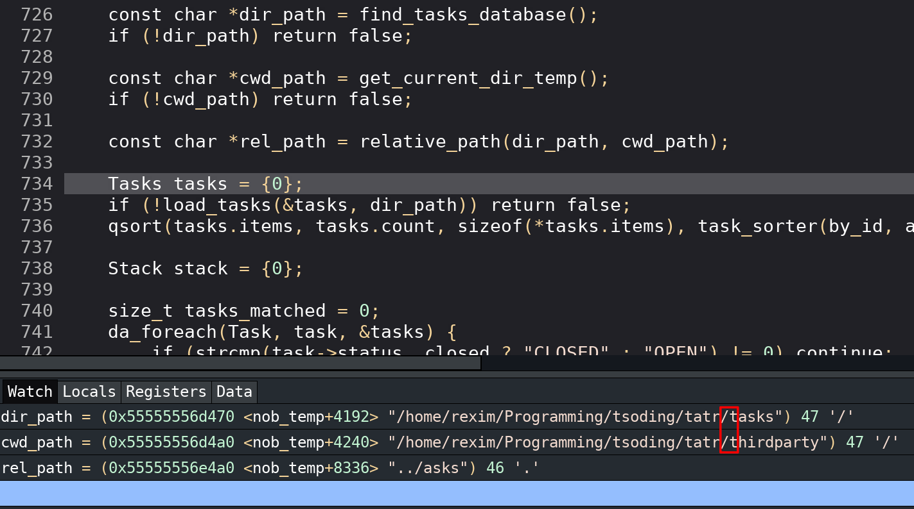

# `tatr ls` relative paths are broken

- STATUS: CLOSED
- PRIORITY: 120
- TAGS: bug,release

Repro:

```console
[streamer@markov thirdparty]$ pwd
/home/streamer/Programming/tsoding/tatr/thirdparty
[streamer@markov thirdparty]$ tatr ls | head
../asks/<HUID>/TASK.md:1: [PRIORITY: 100] Document the filter language
../asks/<HUID>/TASK.md:1: [PRIORITY: 100, TAGS: bug] When you have several TASK.md opened, it's unclear which issues they belong to
../asks/<HUID>/TASK.md:1: [PRIORITY: 100, TAGS: stream] Build a graph of issues crossreferring to each other
../asks/<HUID>/TASK.md:1: [PRIORITY: 90 ] Description for tags
../asks/<HUID>/TASK.md:1: [PRIORITY: 90 ] Priority becomes irrelevant when the task is closed
../asks/<HUID>/TASK.md:1: [PRIORITY: 80 ] There should be a command that reports all the skipped
weird folders and files found in the tasks/ folder
../asks/<HUID>/TASK.md:1: [PRIORITY: 70 , TAGS: bug] Accidental double `tatr new` in Emacs
../asks/<HUID>/TASK.md:1: [PRIORITY: 50 ] Subtasks
../asks/<HUID>/TASK.md:1: [PRIORITY: 50 ] An ability to actually store `tasks` folder outside of
the main repo
../asks/<HUID>/TASK.md:1: [PRIORITY: 50 , TAGS: release] Presentable to GitHub README
```

---

I think I know what's the problem



`relative_path()` function is too naive

---

It would be nice if nob.h just had a special type for file paths or what not:

[./path.c](./path.c)
