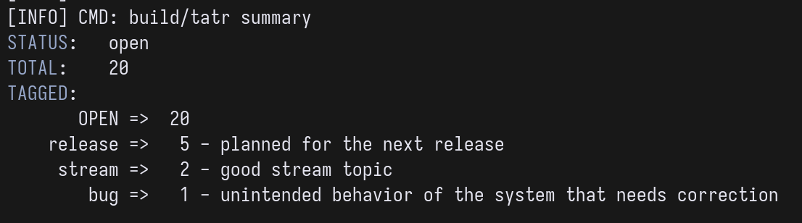

# Support more statuses than OPEN and CLOSED

- STATUS: OPEN
- PRIORITY: 100
- TAGS:

Cephon wanted to kanban this whole thing. I guess we could've just
treated any not "CLOSED" status as opened and let the user put
whatever they want here.

---

As we discovered in 20260826-152351 this is also important in case the
user provided "invalid" status.

---

The status string should be also somehow incorporated into the result
output.

---

Having more than 2 status means that we may also wanna filter by
them. But at that point status because just another tag but
special. Not sure what to do about it.

Maybe if the people want to kanban this entire thing they should just
use tags for that?

---

`STATUS` is just yet another tag. What we just consider a task closed
if it has tag `CLOSED` and for backward compatibility, during the
parsing just append the value of `STATUS` to the `TAGS` list?

---

One advantage a separate `STATUS` property gives is that the task
can't be `OPEN` and `CLOSED` simultaneously.

---

Having `STATUS` being another tag messes with `tatr-summary` command:

---

For now I just implemented so when the status is not "CLOSED" it's
considered "OPEN". No filtering by specific status string is provided
because status can be only either "OPEN" or "CLOSED". An invalid
status string is treated as "OPEN" purely for convenience so the user
doesn't lose the invalid task from their sight.

I'm unscheduling this task from the release. Will see what can be done
in here later.
